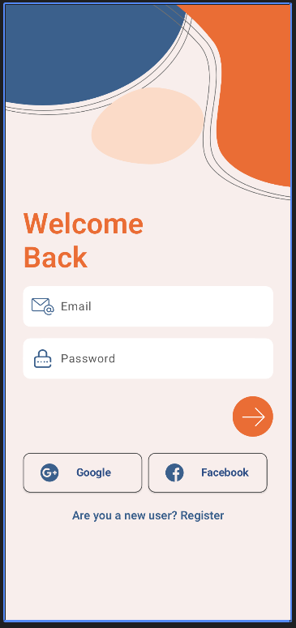
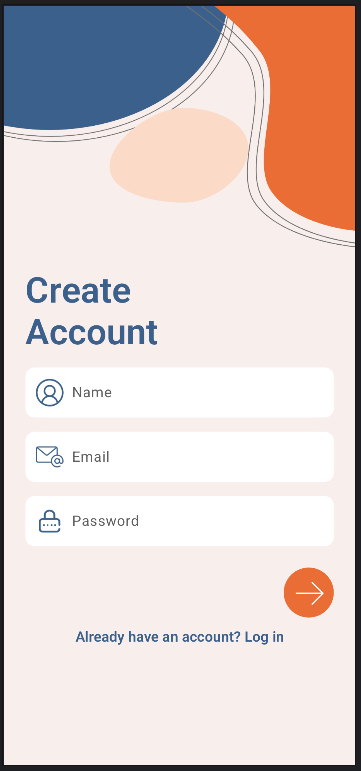

# Ui building exercies

A bunch of simple samples of UI made using compose to practice UI building using only compose components.

# Current samples

## SignIn/SignUp/Dashboard

  
  
  

Design by [Ui Lover Android](https://www.youtube.com/watch?v=RKBmNNovvjE&t=4s)

## Mortgage calculator

Design by [Frontend Mentor](https://www.frontendmentor.io/challenges/mortgage-repayment-calculator-Galx1LXK73)